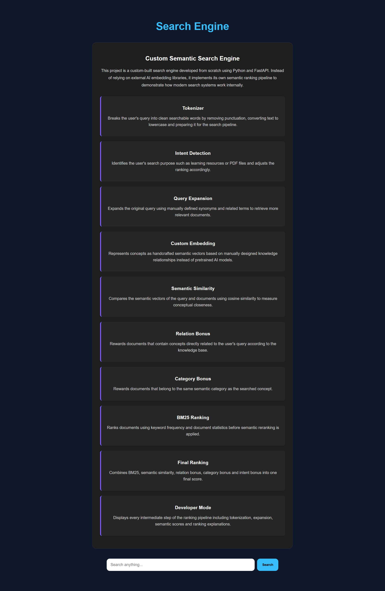
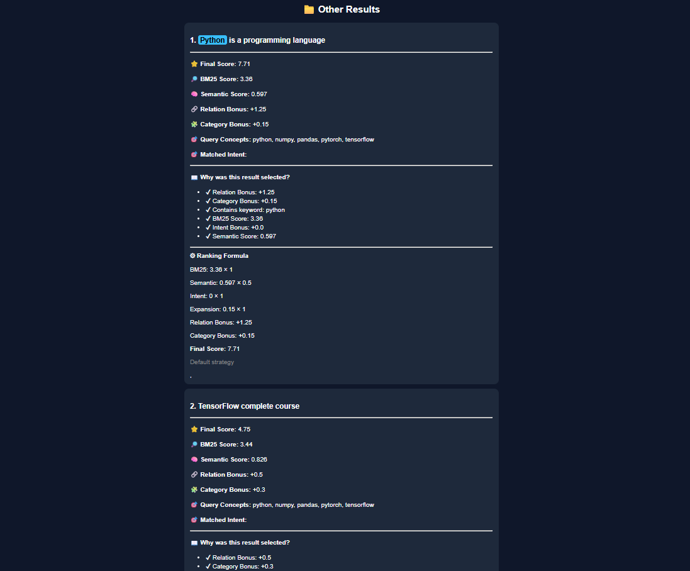
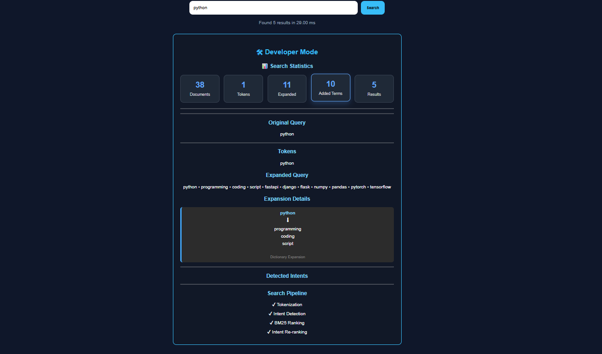

# Custom Semantic Search Engine

A lightweight, research-oriented semantic search engine implemented primarily from scratch in Python.

The project explores how lexical retrieval, query understanding, handcrafted semantic representations, knowledge-based signals, and explainable ranking can be combined without relying on pretrained language models, vector databases, or ready-made information retrieval frameworks.

The main goal is not to reproduce a production-scale search platform, but to understand, implement, and evaluate the core mechanics of information retrieval and ranking directly.

---

## Why This Project?

A search engine becomes useful not simply when it finds matching documents, but when it ranks the most relevant results according to the user's query and intent.

This project explores that problem through a custom and transparent ranking pipeline. Instead of delegating relevance decisions to a pretrained model or ready-made search framework, the engine processes the query, detects intent, expands related concepts, retrieves lexical matches, evaluates handcrafted semantic relationships, and combines multiple ranking signals to produce explainable ordered results.

The objective is not to assume that this custom ranking is always better. Its behavior is measured against a BM25 baseline so that improvements, regressions, and ranking decisions can be examined explicitly.

The project focuses on:

* lexical information retrieval
* semantic similarity
* query understanding
* ranking signals
* explainable scoring
* evaluation methodology
* baseline comparison
* ranking error analysis
* lightweight performance measurement
* experimental model-facing integration through MCP

---

## Core Design Principle

The search and evaluation logic is intentionally kept custom and transparent.

The project does **not** use:

* pretrained embedding models
* Sentence Transformers
* FAISS
* vector databases
* ready-made BM25 libraries
* ready-made ranking engines
* scikit-learn evaluation metrics
* external reranking models

Core IR and evaluation components are implemented directly in Python.

FastAPI, Uvicorn, Pydantic, pytest, and HTTP testing utilities are used only for application infrastructure, API serving, validation, and testing.

The experimental MCP integration is also implemented natively using Python's standard library rather than an MCP SDK.

---

## Search Pipeline

A search request passes through the following high-level pipeline:

```text
User Query
    |
    v
Query Processing
    |
    v
Tokenization
    |
    v
Intent Detection
    |
    v
Query Expansion
    |
    v
Lexical Retrieval (BM25)
    |
    v
Semantic Scoring
    |
    v
Ranking Signals
    |
    v
Final Ranking
    |
    v
Explainable Results
```

The same search engine can currently be accessed through two outer interfaces:

```text
                         +-- REST API -- Web UI
                         |
Custom SearchEngine -----+
                         |
                         +-- Native MCP Adapter
                                |
                                v
                         JSON-RPC / stdio
```

Both interfaces reuse the same `SearchEngine` and `SearchPipeline`. The MCP layer does not implement a separate retrieval or ranking system.

---

## Main Features

### Custom Tokenization

Raw queries and documents are normalized into tokens used by the retrieval pipeline.

The tokenizer handles operations such as lowercasing and punctuation normalization without delegating tokenization to an NLP framework.

### BM25 Lexical Retrieval

The project contains a custom BM25 implementation for lexical document retrieval.

The retrieval layer calculates term relevance using document length, average document length, term frequency, and inverse document frequency.

BM25 also serves as the lexical baseline used in evaluation experiments.

### Intent Detection

The query pipeline detects search intent signals such as learning-oriented or PDF-oriented queries.

Intent information contributes additional ranking signals but does not replace lexical retrieval.

### Query Expansion

Queries can be expanded using handcrafted semantic relationships and weighted expansion terms.

Expansion is designed to improve coverage while keeping the transformation understandable and inspectable.

### Handcrafted Semantic Representation

Instead of pretrained embeddings, semantic concepts are represented through a manually designed knowledge base.

Documents and queries are mapped to these semantic representations and compared using custom similarity logic.

This keeps the semantic layer small, interpretable, and independent of external language models.

### Semantic Ranking

Semantic similarity is calculated in addition to BM25 retrieval.

The final ranking system combines multiple signals, including:

* BM25 score
* semantic similarity
* expansion bonus
* intent bonus
* exact-match bonus
* relation bonus
* category bonus

The ranking formula remains explicit in the codebase rather than being delegated to a pretrained reranker.

### Explainable Results

Search results include individual score components and ranking reasons.

This makes it possible to inspect why a document received its final position rather than treating ranking as a black box.

### Native MCP Integration

The project includes an experimental native MCP server that exposes the existing search engine as a tool over JSON-RPC and standard input/output.

The MCP adapter currently exposes:

```text
search_documents
```

The tool accepts a search query and delegates execution to the same custom `SearchEngine` used by the REST application.

The current implementation includes:

* initialization handling
* tool discovery through `tools/list`
* tool execution through `tools/call`
* JSON-RPC error handling
* initialized-notification handling
* native stdio message transport

The implementation targets MCP protocol revision `2025-11-25`.

It is intentionally minimal and experimental. It should not be interpreted as a complete MCP implementation or a production-grade MCP deployment.

No MCP SDK or additional MCP dependency is used.

---

## Architecture

The backend is separated into API, MCP, query-processing, retrieval, semantic, ranking, pipeline, and evaluation layers.

```text
backend/
|-- api/
|   |-- health.py
|   |-- search.py
|   |-- suggest.py
|   `-- schemas.py
|
|-- core/
|   `-- config.py
|
|-- data/
|   `-- documents.py
|
|-- evaluation/
|   |-- metrics.py
|   |-- dataset.py
|   |-- runner.py
|   |-- report.py
|   |-- baseline.py
|   |-- baseline_experiment.py
|   |-- error_analysis.py
|   `-- latency_benchmark.py
|
|-- mcp/
|   |-- __init__.py
|   `-- server.py
|
|-- models/
|   `-- query.py
|
|-- pipelines/
|   `-- search_pipeline.py
|
|-- services/
|   |-- embeddings/
|   |   |-- document_embeddings.py
|   |   |-- embedding_engine.py
|   |   `-- knowledge_base.py
|   |
|   |-- query/
|   |   |-- autocomplete.py
|   |   |-- tokenizer.py
|   |   |-- query_processor.py
|   |   |-- intent_detector.py
|   |   |-- query_expander.py
|   |   `-- ranking_strategy.py
|   |
|   `-- search/
|       |-- bm25.py
|       |-- index.py
|       |-- search.py
|       |-- search_retriever.py
|       |-- semantic_ranker.py
|       |-- ranking_engine.py
|       |-- result_scorer.py
|       |-- result_builder.py
|       `-- search_engine.py
|
|-- tests/
|-- dependencies.py
|-- app.py
`-- main.py
```

The frontend is implemented using HTML, CSS, and JavaScript and is served by the FastAPI application.

---

## Data Sources

The project currently uses a small handcrafted document collection rather than an external search corpus.

The searchable document collection is defined in:

```text
backend/data/documents.py
```

These documents form the corpus searched by both the BM25 baseline and the complete search engine.

The evaluation queries and manually defined relevance judgments are stored separately in:

```text
backend/evaluation/dataset.py
```

The distinction is important:

```text
documents.py
    -> documents available for retrieval

evaluation/dataset.py
    -> evaluation queries
    -> expected relevant documents
    -> relevance judgments used to measure ranking quality
```

The current data is intentionally small and controlled. It is designed for implementation experiments and ranking analysis rather than large-scale benchmark claims.

---

## Evaluation

The project includes a custom evaluation layer for measuring retrieval and ranking behavior.

Implemented metrics include:

* Precision@K
* Recall@K
* Mean Reciprocal Rank (MRR)
* Discounted Cumulative Gain (DCG@K)
* Normalized Discounted Cumulative Gain (nDCG@K)

The metrics are implemented directly in Python rather than through an external evaluation library.

The current evaluation dataset contains a small manually labeled set of queries and relevant documents.

Because the dataset is intentionally small, the reported numbers should be interpreted as controlled internal measurements rather than as a general benchmark of search quality.

---

## BM25 Baseline Experiment

A BM25-only baseline is included to compare the complete search pipeline against a simpler lexical retrieval system.

Both systems are evaluated using the same documents, queries, relevance judgments, and cutoff.

Current internal evaluation results at `K=5`:

```text
Metric              BM25 Baseline    Search Engine
Precision@5         0.3500           0.3500
Recall@5            0.8125           0.8125
MRR                 1.0000           1.0000
nDCG@5              0.8579           0.8460
```

The complete search engine does not outperform the BM25 baseline on this small evaluation set.

In particular, BM25 currently achieves slightly higher mean nDCG@5.

This result is intentionally preserved rather than hidden because the purpose of the experiment is to evaluate ranking behavior, not to assume that additional semantic components automatically improve retrieval quality.

---

## Error Analysis

Per-query error analysis was added to investigate the nDCG difference between the baseline and the full search engine.

On the current evaluation dataset:

```text
Improved queries:  0
Regressed queries: 1
Unchanged queries: 7
```

The observed regression occurs for:

```text
programming course
```

For this query, both systems retrieve relevant documents, but their ranking positions differ.

The BM25 baseline places a second relevant document at rank 2, while the full search engine places its second relevant result at rank 5.

This demonstrates an important distinction between retrieval coverage and ranking quality: two systems can have the same Precision@K and Recall@K while producing different nDCG scores.

---

## Lightweight Latency Benchmark

A lightweight local micro-benchmark compares the execution latency of the BM25 baseline and the complete search engine.

The benchmark uses the existing 8-query evaluation dataset with 10 repeated runs, producing 80 measurements for each system.

One local run produced:

```text
BM25 Baseline
Mean latency: 0.1080 ms
Min latency:  0.1023 ms
Max latency:  0.1500 ms

Current Search Engine
Mean latency: 0.9477 ms
Min latency:  0.5640 ms
Max latency:  2.2379 ms
```

These values are local micro-benchmark measurements only.

They should not be interpreted as production latency, throughput, concurrent-request performance, network latency, or scalability limits.

The complete search engine is expected to require more computation because it performs additional query-processing, semantic, and ranking operations beyond BM25 retrieval.

---

## Testing

The backend currently has:

```text
162 passing tests
```

The test suite covers areas including:

* query processing
* tokenization
* intent detection
* query expansion
* ranking
* BM25 retrieval
* semantic components
* result scoring
* result building
* autocomplete
* search pipeline behavior
* API validation
* frontend serving
* evaluation metrics
* evaluation datasets and runners
* baseline experiments
* error analysis
* latency benchmarking
* MCP JSON-RPC handling
* MCP initialization
* MCP tool discovery
* MCP tool execution
* MCP stdio message handling

Run the full test suite with:

```bash
python -m pytest backend/tests -q
```

---

## Technologies

Application infrastructure:

* Python 3.13
* FastAPI
* Uvicorn
* Pydantic
* pytest
* HTML
* CSS
* JavaScript

The external Python libraries are used for API/application infrastructure and testing, not to replace the custom search and ranking implementation.

The native MCP adapter uses Python standard-library functionality for JSON processing and stdio communication.

---

## Getting Started

### Requirements

Install:

* Python 3.13
* Git

Clone the repository:

```bash
git clone https://github.com/Parisa-Noroozi/Custom-Semantic-Search-Engine.git
cd Custom-Semantic-Search-Engine
```

### Create a Virtual Environment

Windows:

```powershell
python -m venv .venv
.venv\Scripts\Activate.ps1
```

macOS/Linux:

```bash
python3 -m venv .venv
source .venv/bin/activate
```

### Install Dependencies

For a complete development setup, including the application and test dependencies:

```bash
python -m pip install -r requirements-dev.txt
```

`requirements-dev.txt` also installs the runtime dependencies from `requirements.txt`, so a separate runtime installation command is not required for development.

For runtime-only installation:

```bash
python -m pip install -r requirements.txt
```

### Run Tests

```bash
python -m pytest backend/tests -q
```

### Start the Application

Start the FastAPI application with:

```bash
uvicorn backend.main:app --reload
```

The FastAPI application serves both the REST API and the frontend. A separate frontend development server such as Live Server is not required.

Open the Web UI:

```text
http://127.0.0.1:8000
```

FastAPI interactive API documentation:

```text
http://127.0.0.1:8000/docs
```

Health endpoint:

```text
http://127.0.0.1:8000/health
```

Main API endpoints include:

```text
GET /health
GET /search
GET /suggest
```

For example:

```text
GET /search?q=python%20tutorial
```

---

## Run the Native MCP Server

The experimental MCP server can be started directly with Python:

```bash
python -m backend.mcp.server
```

The server communicates through standard input and standard output using JSON-RPC messages.

It currently exposes one tool:

```text
search_documents
```

Example tool discovery request:

```json
{"jsonrpc":"2.0","id":1,"method":"tools/list"}
```

Example tool call:

```json
{"jsonrpc":"2.0","id":2,"method":"tools/call","params":{"name":"search_documents","arguments":{"query":"python tutorial"}}}
```

The MCP adapter delegates the query to the existing custom search engine and returns the ranked search results.

The current implementation targets protocol revision `2025-11-25` and is intended as a minimal experimental integration rather than a complete or production-grade MCP server.

---

## Running the Research Utilities

The research utilities operate on the project's handcrafted search corpus and evaluation dataset.

Searchable documents are stored in:

```text
backend/data/documents.py
```

Evaluation queries and relevance judgments are stored in:

```text
backend/evaluation/dataset.py
```

### Evaluation Report

Run:

```bash
python -m backend.evaluation.report
```

This evaluates the complete search engine against the manually defined relevance judgments using metrics such as Precision@K, Recall@K, MRR, and nDCG@K.

### BM25 Baseline Comparison

Run:

```bash
python -m backend.evaluation.baseline_experiment
```

This evaluates the BM25-only retrieval baseline and the complete search engine on the same corpus, queries, relevance judgments, and cutoff.

The comparison is used to determine whether the additional query-processing, semantic, and ranking signals improve or regress ranking quality relative to lexical retrieval alone.

### Per-Query Error Analysis

Run:

```bash
python -m backend.evaluation.error_analysis
```

This compares ranking behavior query by query and identifies cases where the complete search engine improves, regresses, or remains unchanged relative to the BM25 baseline.

### Latency Benchmark

Run:

```bash
python -m backend.evaluation.latency_benchmark
```

This performs a lightweight local latency comparison between the BM25 baseline and the complete search engine.

The results are intended for local implementation analysis only and should not be interpreted as production performance or scalability measurements.

---

## Limitations

This project is intentionally small and research-oriented.

Current limitations include:

* a small handcrafted document collection
* a small manually labeled evaluation dataset
* handcrafted semantic concepts
* no learned embeddings
* no ANN/vector index
* no large-scale retrieval benchmark
* no concurrency or load testing
* no production-scale relevance judgments
* no learned ranking model
* minimal experimental MCP integration rather than full protocol coverage
* stdio-only MCP transport
* no production MCP deployment or authentication layer

These constraints are important when interpreting the evaluation results.

The current results demonstrate implementation, integration, and analysis methodology rather than state-of-the-art search performance.

---

## Future Work

Possible future directions include:

* evaluation on a larger and more diverse corpus
* larger relevance-judgment datasets
* controlled ranking experiments
* scalability evaluation
* comparison with pretrained semantic retrieval systems as external baselines
* approximate nearest-neighbor retrieval for larger collections
* learning-to-rank experiments
* broader MCP protocol coverage and interoperability testing
* additional MCP tools where they provide a clear interface to existing search functionality

External models or retrieval libraries, if introduced in future experiments, should be treated as explicit comparison baselines rather than silent replacements for the custom implementation.

---

## Educational and Research Purpose

This project was intentionally developed to study the mechanics of information retrieval rather than hide them behind high-level search frameworks.

The implementation emphasizes:

* understanding retrieval algorithms
* explicit ranking logic
* modular architecture
* testability
* measurable evaluation
* reproducible comparisons
* analysis of unsuccessful as well as successful results
* separation between core search logic and external interfaces

The project is intended as an evolving educational and research implementation, not as a claim of production-scale search performance.

---

## Screenshots

### Home Page



### Search Results



### Developer Mode



### Full Page


